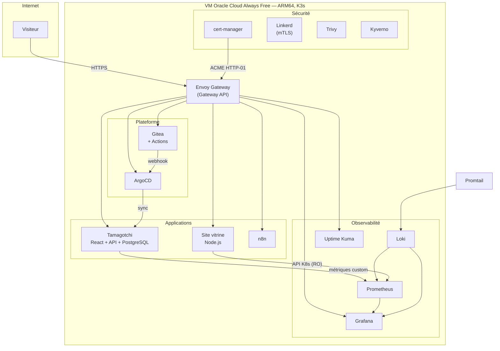

# Showroom DevOps — khalilaliouich.com

Plateforme Kubernetes complète — GitOps, observabilité, service mesh, DevSecOps —
autohébergée sur **une seule VM Oracle Cloud Always Free** (ARM Ampere A1, 4 OCPU,
24 Go). Coût d'exploitation : **0 €/mois**.

**→ [khalilaliouich.com](https://khalilaliouich.com)** · [statut](https://status.khalilaliouich.com) · [démo](https://demo.khalilaliouich.com)

---

## Architecture



## Stack

| Domaine | Outils |
|---|---|
| Orchestration | K3s (sans Traefik) |
| Routing | Envoy Gateway (Gateway API), cert-manager, Let's Encrypt |
| GitOps | ArgoCD (`selfHeal` + `prune`), Gitea |
| CI/CD | Gitea Actions (compatible GitHub Actions) |
| Observabilité | Prometheus, Grafana, Loki + Promtail, Uptime Kuma |
| Service mesh | Linkerd (mTLS) |
| DevSecOps | Trivy Operator, Kyverno (Policy-as-Code) |
| Démo | Tamagotchi as a Service — React / Node.js / PostgreSQL |

## Ce que le projet démontre

**Contraintes ARM64 + Free Tier.** Faire cohabiter un cluster complet, sa stack
d'observabilité, un service mesh et une application 3-tiers dans 24 Go de RAM
partagés. La plupart des images de l'écosystème ne publient pas d'ARM64 : chaque
composant a dû être vérifié, et les composants trop lourds écartés au profit
d'alternatives adaptées (Gitea plutôt que GitLab).

**Un dashboard réellement live.** Le site interroge l'API Kubernetes via un
ServiceAccount en lecture seule et Prometheus pour le CPU/RAM/disque. Les chiffres
affichés sont mesurés, pas simulés.

**Du debug documenté.** [`TECHNICAL_ISSUES_RESOLVED.md`](TECHNICAL_ISSUES_RESOLVED.md)
recense les pannes réelles et leur résolution : fragmentation MTU sur les runners
Gitea en réseau bridge, sidecar Linkerd cassant le gRPC d'ArgoCD, `ErrImageNeverPull`
dû au mauvais socket containerd, race condition i18n côté front.

## Structure

```
k8s/
  cert-manager/   ClusterIssuer + Certificate (ACME HTTP-01 via Gateway API)
  monitoring/     Dashboards Grafana
  rbac/           ServiceAccounts et ClusterRoles en lecture seule
  tamagotchi/     Manifestes de l'application de démo
  uptime-kuma/    Supervision externe
website/          Site vitrine — backend Node.js + front vanilla
tamagotchi/       Code source de l'app de démo (api/ + frontend/)
scripts/          Scripts de bootstrap par phase
```

## Sécurité

- **Aucun secret dans ce dépôt.** Les archives et le matériel cryptographique sont
  bloqués par `.gitignore` *et* par la CI (gitleaks + refus des archives par
  extension — un scanner de contenu ne voit pas dans un `.zip`).
- **Certificats gérés par cert-manager**, renouvelés automatiquement avec
  **rotation de clé à chaque renouvellement** (`rotationPolicy: Always`).
- **RBAC en lecture seule** pour les composants exposés ; l'endpoint public
  `/api/infra` ne divulgue que les namespaces de la vitrine.
- Les accès visiteurs (ArgoCD, Grafana) sont volontairement en lecture seule.

## Développement local

```bash
cd website
npm ci
npm start        # http://localhost:3000
```

Hors cluster, `/api/infra` renvoie `503` — le ServiceAccount Kubernetes est absent.
`PROMETHEUS_URL` et `PUBLIC_NAMESPACES` sont surchargeables par variable
d'environnement.
