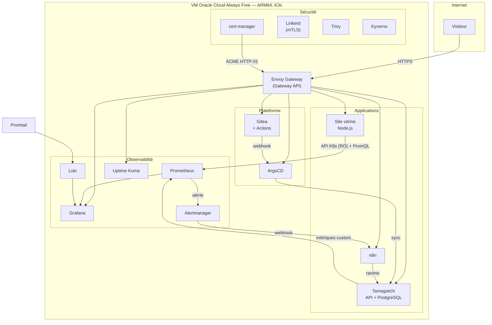

# Showroom DevOps — khalilaliouich.com

Plateforme Kubernetes complète — GitOps, observabilité, service mesh, auto-réparation,
DevSecOps — autohébergée sur **une seule VM Oracle Cloud Always Free** (ARM Ampere A1,
4 OCPU, 24 Go). Coût d'exploitation : **0 €/mois**.

**→ [khalilaliouich.com](https://khalilaliouich.com)** · [statut](https://status.khalilaliouich.com) · [démo](https://demo.khalilaliouich.com) · [ArgoCD (invité)](https://argocd.khalilaliouich.com)

---

## Architecture


```mermaid
graph TB
    subgraph Internet
        U[Visiteur]
    end

    subgraph "VM Oracle Cloud Always Free — ARM64, K3s"
        EG["Envoy Gateway<br/>(Gateway API)"]

        subgraph "Plateforme"
            AC[ArgoCD]
            GT["Gitea<br/>+ Actions"]
        end

        subgraph "Observabilité"
            PR[Prometheus]
            GF[Grafana]
            LK[Loki]
            AM[Alertmanager]
            UK[Uptime Kuma]
        end

        subgraph "Applications"
            WS["Site vitrine<br/>Node.js"]
            TG["Tamagotchi<br/>API + PostgreSQL"]
            N8[n8n]
        end

        subgraph "Sécurité"
            CM[cert-manager]
            LD["Linkerd<br/>(mTLS)"]
            TV[Trivy]
            KV[Kyverno]
        end
    end

    U -->|HTTPS| EG
    EG --> WS & TG & AC & GF & GT & UK & N8
    GT -->|webhook| AC
    AC -->|sync| TG
    TG -->|métriques custom| PR
    PR --> GF
    PR -->|alerte| AM -->|webhook| N8 -->|ranime| TG
    LO[Promtail] --> LK --> GF
    WS -->|"API K8s (RO) + PromQL"| PR
    CM -->|"ACME HTTP-01"| EG
```

## Ce qui rend cette vitrine vérifiable, pas juste affirmée

- **Tout est reconstructible depuis zéro.** [Terraform](infra/terraform/) pour
  l'infrastructure Oracle Cloud, [Ansible](infra/ansible/) pour tout ce qui vit
  dans la machine et le cluster. Procédure complète et chronométrée dans
  [`infra/DISASTER-RECOVERY.md`](infra/DISASTER-RECOVERY.md).
- **La chaîne d'auto-réparation est réelle, pas une démo scénarisée.** Une
  créature du Tamagotchi meurt → Prometheus détecte → Alertmanager route sur un
  label → n8n ranime. Et une seconde alerte critique surveille l'échec de
  cette remédiation elle-même — voir la section *Self-healing* du site.
- **Les pannes rencontrées sont documentées**, causes racines et commandes de
  résolution incluses : [`TECHNICAL_ISSUES_RESOLVED.md`](TECHNICAL_ISSUES_RESOLVED.md)
  et la page [Issues](https://khalilaliouich.com/issues.html) du site.
- **La CI publique** ([`.github/workflows/ci.yml`](.github/workflows/ci.yml))
  scanne les secrets (gitleaks), construit et scanne l'image (Trivy), valide
  tous les manifestes Kubernetes (kubeconform) à chaque push.

## Structure du dépôt

```
website/          le site vitrine (Node.js, i18n FR/EN)
tamagotchi/       l'application de démonstration
k8s/              manifestes : RBAC, LimitRange, applications, runbooks
infra/terraform/  couche Oracle Cloud (réseau, instance, IP réservée)
infra/ansible/    couche Kubernetes, 5 rôles
infra/bootstrap/  cloud-init, installation shell de secours, restauration
scripts/          sauvegarde quotidienne, détection de secrets
```

Contexte complet, versions exactes des composants et pièges connus :
[`PROJECT_CONTEXT.md`](PROJECT_CONTEXT.md).

## Freelance

Disponible pour des missions DevOps / Platform Engineering — voir la section
[Hire Me](https://khalilaliouich.com/#freelance) du site.
